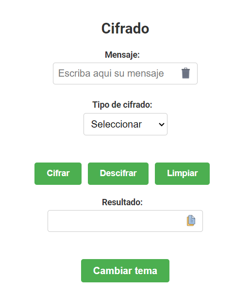

# Cifrado y Descifrado Web

Este es un proyecto de una página web simple que proporciona funcionalidad para el cifrado y descifrado utilizando los métodos de Cifrado César y Cifrado Afín. La página está desarrollada con HTML, CSS y JavaScript.

## Características

- Cifrado y descifrado utilizando el método de Cifrado César y Cifrado Afín.
- Personalización del desplazamiento para el Cifrado César y las claves para el Cifrado Afín.
- Cambio entre temas claro y oscuro.
- Interfaz de usuario amigable y responsive.

## Demo

Puedes ver una demostración en vivo del proyecto [aquí](#).

## Capturas de Pantalla

### Tema Claro



Esta captura de pantalla muestra la página con el tema claro aplicado. Los colores predominantes son suaves y claros, lo que proporciona una apariencia agradable y luminosa. Los elementos de la interfaz son fácilmente distinguibles y se adaptan a un fondo claro. 

### Tema Oscuro


En esta captura de pantalla, se muestra la página con el tema oscuro activado. Los colores utilizados son más oscuros y se ajustan a un fondo oscuro, lo que proporciona una apariencia elegante y moderna. El texto y los elementos resaltan gracias a los colores contrastantes. El tema oscuro también puede ayudar a reducir la fatiga visual en entornos de poca luz.


## Instalación

1. Clona este repositorio en tu máquina local:

   ```bash
   git clone https://github.com/Dennis290699/Encryption_techniques.git
   ```

2. Navega hasta el directorio del proyecto:

   ```bash
   cd nombre-del-repo
   ```

3. Abre el archivo `index.html` en tu navegador web.

## Personalización

Puedes personalizar el proyecto según tus necesidades:

- Modifica el diseño y los estilos en el archivo CSS (`style.css`).
- Añade más métodos de cifrado y descifrado en el archivo JavaScript (`script.js`).
- Añade más opciones de personalización en el archivo HTML (`index.html`).

## Contribución

Si deseas contribuir a este proyecto, sigue estos pasos:

1. Haz un fork de este repositorio.
2. Crea una nueva rama para tus cambios:

   ```bash
   git checkout -b feature/nueva-funcionalidad
   ```

3. Realiza tus cambios y haz commits:

   ```bash
   git commit -m "Agrega nueva funcionalidad"
   ```

4. Empuja tus cambios a tu repositorio fork:

   ```bash
   git push origin feature/nueva-funcionalidad
   ```

5. Abre un pull request en este repositorio.

## Licencia

Este proyecto está licenciado bajo la [Licencia MIT](LICENSE).
